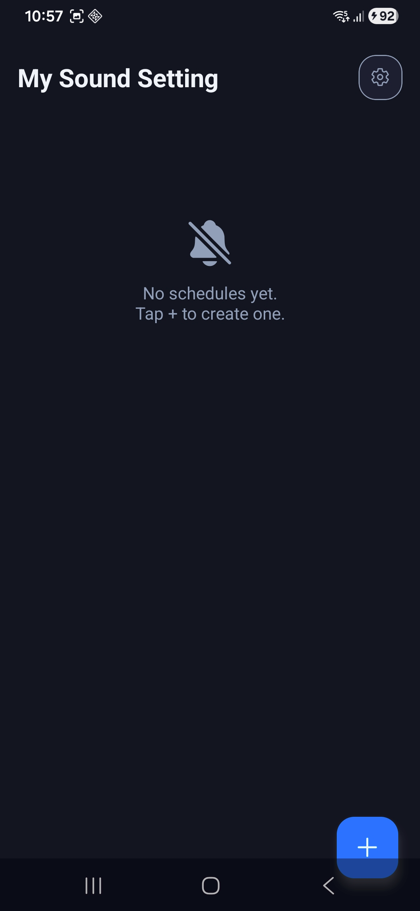
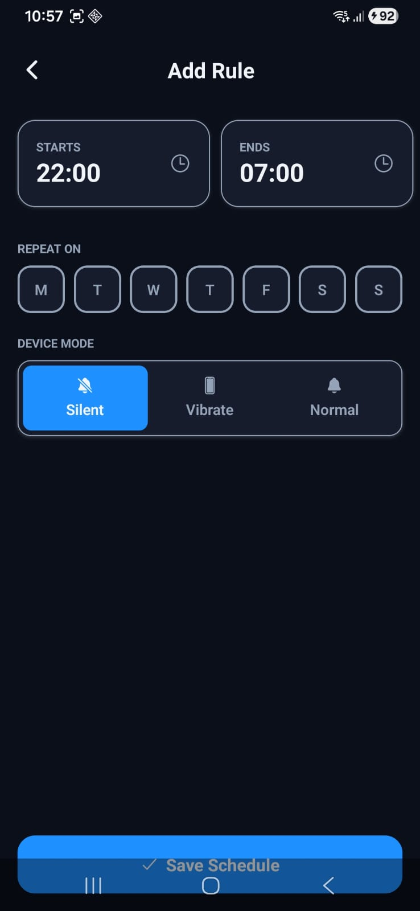
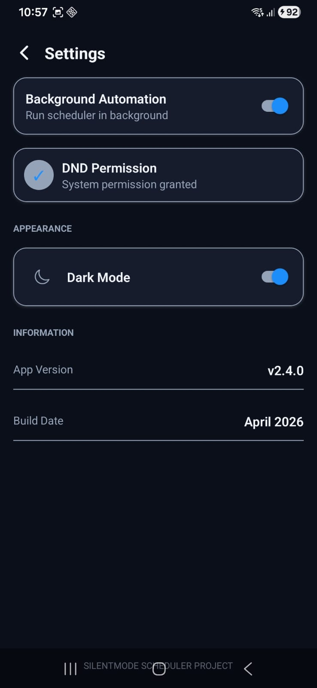
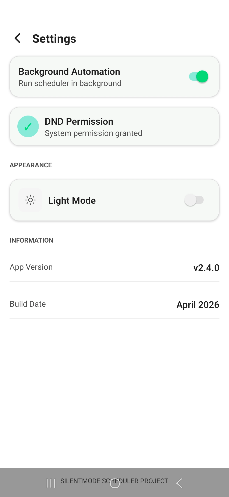
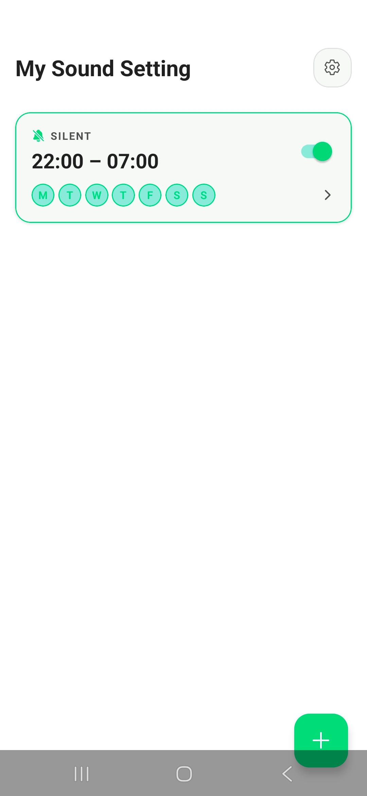
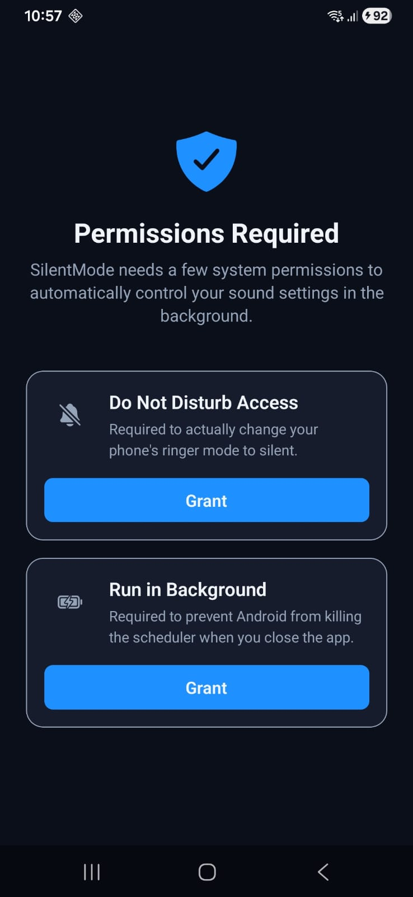

# 📱 Silent Mode Scheduler
**Intelligent sound automation for your Android device.**


---

## 🚀 Overview

Tired of your phone ringing in meetings or staying silent after you've left? **Silent Mode Scheduler** is a robust Android automation tool that lets you define custom sound profiles (Silent, Vibrate, Normal) based on your daily routine. Designed for reliability and privacy, it works entirely offline and leverages native Android services to ensure your schedules are always met.

---

## ✨ Features

### 🛠️ Core Features
- **Smart Scheduling**: Set precise Start and End times for your sound profiles.
- **Multi-Day Control**: Select specific days of the week for each automation rule.
- **Mode Switching**: Seamlessly toggle between **Silent**, **Vibrate**, and **Normal** modes.
- **Offline First**: All data is stored locally; no internet connection required.

### 🧠 Advanced Features
- **Overnight Support**: Create schedules that span across midnight (e.g., 10 PM to 7 AM).
- **Conflict Handling**: Intelligent logic to prevent overlapping schedule issues.
- **Native Automation**: Uses a dedicated Android Foreground Service for high reliability even when the app is closed.

### 🎨 UX & Design
- **Modern UI**: Clean, minimal interface built with React Native Reanimated for smooth transitions.
- **Theme Support**: Fully optimized for both **Dark** and **Light** modes.
- **Guided Setup**: Easy-to-follow permission flows to get you started quickly.

---

## 📸 Screenshots

| 🏠 Home Screen | ⏰ Create Schedule | ⚙️ Settings |
|:---:|:---:|:---:|
|  |  |  |
| *Manage all your active and inactive schedules at a glance.* | *Highly customizable time and day selectors for precise control.* | *Quick access to theme preferences and permission management.* |

| 🌗 Light Mode Settings | 🌗 Light Mode Create | 🔐 Permissions |
|:---:|:---:|:---:|
|  |  |  |
| *Full support for system light mode with high-contrast UI.* | *Consistent experience across both theme profiles.* | *Transparent and guided setup for required system access.* |

---

## 🏗️ Architecture

The app is built using a layered architecture to ensure reliability and separation of concerns:

- **Frontend (React Native)**: A modern UI built with TypeScript and React Navigation.
- **State Management**: Uses React Hooks and Context API for global app state.
- **Local Database (SQLite)**: Persistent storage for schedules using `expo-sqlite`.
- **Native Layer (Kotlin)**: Custom Expo Modules and Android Services for system-level interactions.
- **Background Scheduler**: A dedicated Android Foreground Service that runs independently of the React Native JS thread.

---

## 🧠 How It Works

1. **User Definition**: When you create a schedule, the app saves the time, selected days, and desired sound mode into the local **SQLite** database.
2. **Persistence**: The data remains on your device, ensuring privacy and offline functionality.
3. **Continuous Evaluation**: A native **Android Foreground Service** runs in the background, waking up periodically (or triggered by alarms) to check the current time and day against your saved schedules.
4. **Conflict Resolution**: The scheduler evaluates overlapping rules to ensure the most relevant profile is applied.
5. **Execution**: Once a match is found, the app communicates with the Android `AudioManager` via a custom native module to switch the device's ringer mode.

---

## ⚙️ Tech Stack

- **React Native (Expo Bare Workflow)**
- **TypeScript**
- **SQLite (Local Storage)**
- **Android Native Modules (Kotlin)**
- **Expo Modules API**

---

## 🔐 Permissions Required

To provide reliable automation, the app requires the following system permissions:

- **Do Not Disturb (DND) Access**: Required to toggle the device into "Silent" mode. Without this, Android prevents apps from overriding system sound profiles.
- **Modify Audio Settings**: Allows the app to programmatically adjust the ringer and notification volumes.
- **Battery Optimization Exemption**: **(Highly Recommended)** Android's "Doze" mode can delay or block background services. Exempting the app ensures your schedules trigger exactly on time.
- **Boot Receiver**: Allows the background scheduler to restart automatically whenever you reboot your phone.

---

## 📦 Installation

### 🔹 Option 1: Install APK (Recommended for Users)
1. Navigate to the [Releases](https://github.com/AdityaKarippadathUdai/Sound-Controller/releases) page.
2. Download the latest `app-release.apk`.
3. Open the file on your Android device and follow the installation prompts.
4. **Important**: Grant "Do Not Disturb" access when prompted by the app.

### 🔹 Option 2: Build from Source (For Developers)
1. **Clone the repository**:
   ```bash
   git clone https://github.com/AdityaKarippadathUdai/Sound-Controller
   cd Sound-Controller
   ```
2. **Install dependencies**:
   ```bash
   npm install
   ```
3. **Prebuild & Run**:
   ```bash
   npx expo prebuild
   npx expo run:android
   ```

---

## 📖 Usage

1. **Grant Permissions**: Upon first launch, the app will request DND and Battery access. Follow the on-screen prompts.
2. **Create a Schedule**: Tap the **"+"** button on the home screen.
3. **Configure**: Select your start/end times, the days of the week, and the desired sound mode.
4. **Save**: Once saved, the background service will automatically take over.
5. **Manage**: You can toggle schedules on/off or edit them anytime from the main list.

---

## 🛠️ Troubleshooting

- **Schedules not triggering?**
  - Ensure **Battery Optimization** is disabled for the app.
  - Check if the app has **DND Access** in System Settings.
- **App muting at wrong times?**
  - Verify that you don't have overlapping schedules with conflicting modes.
- **Silent mode not activating?**
  - Some Android skins require explicit permission for "Modify System Settings." Check the permissions screen in the app.

---

## 🗺️ Roadmap

- [ ] **Custom Profile Names**: Label your schedules (e.g., "Work", "Sleep").
- [ ] **Location-based Triggers**: Auto-silence when arriving at a specific location.
- [ ] **Calendar Integration**: Sync with Google Calendar events.
- [ ] **Widget Support**: Quick toggle from the home screen.
- [ ] **Play Store Release**: Final polish for official distribution.

---

## 👤 Author

**Aditya Karippadath Udai**
- GitHub: [@AdityaKarippadathUdai](https://github.com/AdityaKarippadathUdai)
- LinkedIn: [Aditya Karippadath Udai](https://www.linkedin.com/in/aditya-udai-a580a232a/)

---

## ⚖️ License

This project is licensed under the **MIT License** - see the [LICENSE](LICENSE) file for details.